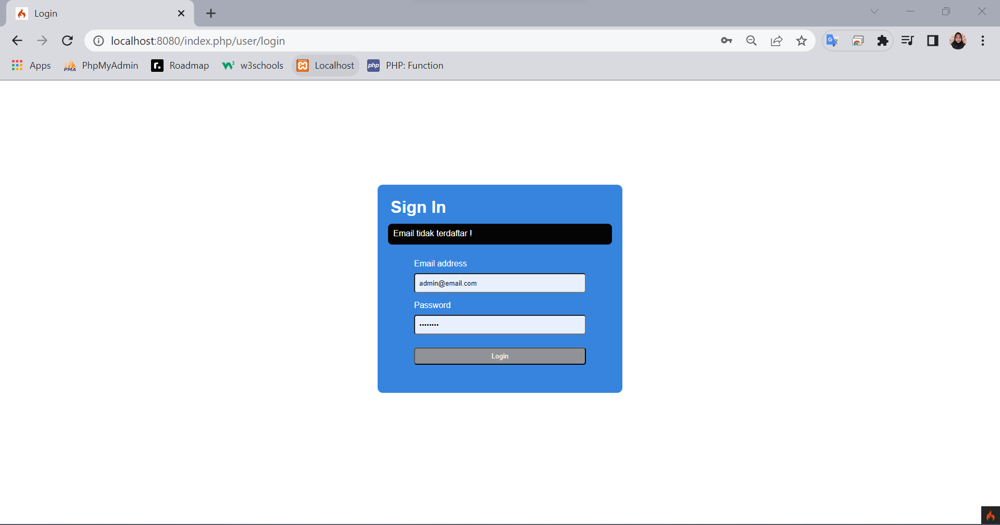
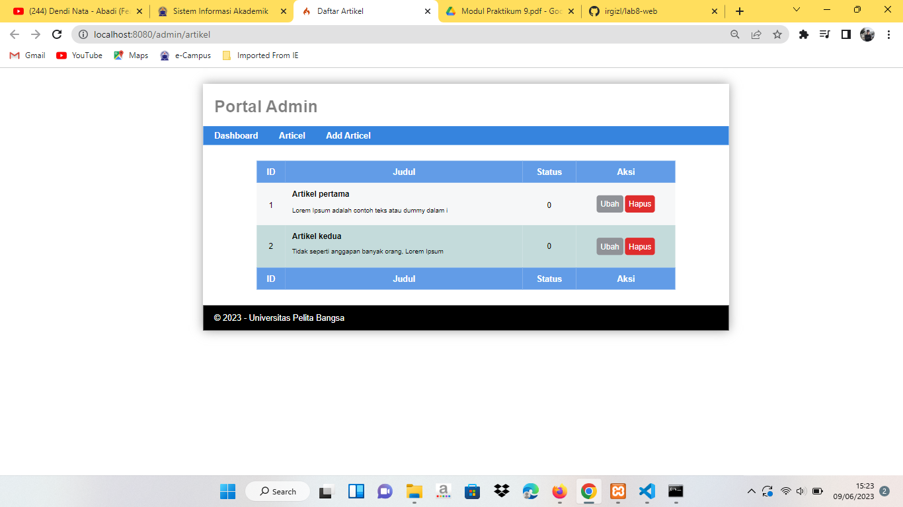
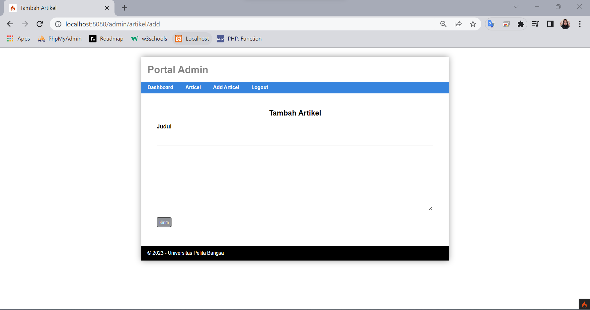
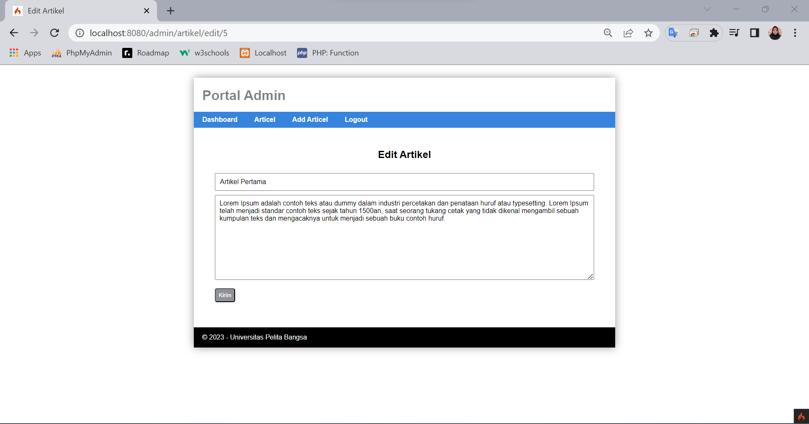
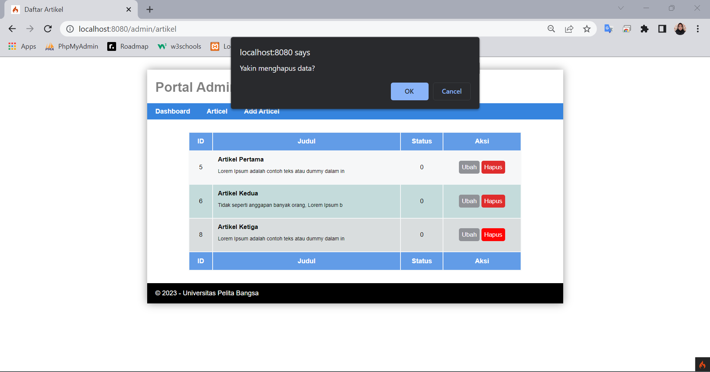

# Praktikum 9: Framework Lanjutan - Modul Login

```bash
Nama    : Irgi Jaelani
Kelas   : TI.21.A.3
Nim     : 312110618
```

## Output

```bash
Output terbaru dengan adanya tampilan login pada portal admin :
```

## Menu Admin

1. Sign In u/ Admin


2. Validasi Email



3. Artikel Admin Terbaru



4. Tambah Artikel Terbaru



5. Ubah Artikel



6. Hapus Artikel




Terimkasih